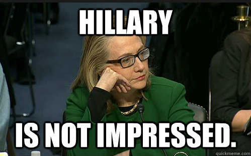

# Project Milestone 3: First Draft

The notebook I'm submitting for this milestone contains all cumulative work until this point, and includes explanations of any roadblocks I've encountered and changes I've made as a result:

PM3: <a href="https://github.com/justindelatorre/data_science/blob/master/hw_justindelatorre/final_project/pm3/pm3-first_draft-justindelatorre.ipynb">IPython Notebook</a>

For reference, I've included the IPython Notebook for the prior milestone. Its contents can be found within the PM3 notebook as well, however.

PM2: <a href="https://github.com/justindelatorre/data_science/blob/master/hw_justindelatorre/final_project/pm2-data_ready-justindelatorre.ipynb">IPython Notebook</a>

My next steps are:
<ul>
<li>Finishing the final master <code>DataFrame</code>, which will contain aggregate word counts for every president, and will join the ranking, party, and religion data from other sources</li>
<li>Create initial exploratory visualizations to attempt to tease out any patterns in the aggregated data</li>
<li>(Optional) Use <a href="http://www.nltk.org/">NLTK</a> to detect themes and similar words and to conduct sentiment analysis</li>
<li>Train and test target models (mostly likely Naive Bayes and/or regression models)</li>
<li>Create final presentation from conclusions</li>
</ul>

The NLTK work is largely inspired by a prior GA Data Science project - <a href="https://github.com/dyerrington/Rapstats">RapStats</a> - which implemented NLTK to classify common themes among hip-hop artists.
